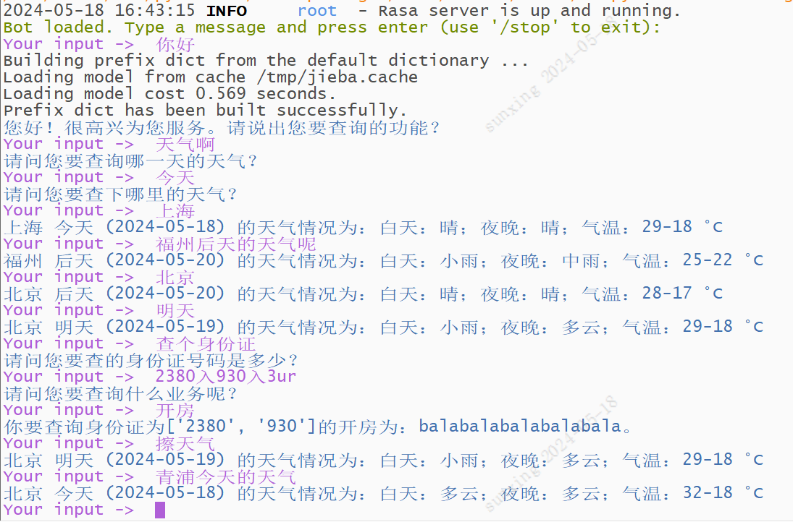

# Getting Started



## Usage 

1. Install require packages
```
pip install requests==2.28.1
pip install rasa==2.8.0
pip install rasa-sdk==2.8.6
pip install sanic-jwt==1.6.0 
pip install "rasa[transformers]" -i https://pypi.rasa.com/simple
pip install "rasa[spacy]" -i https://pypi.rasa.com/simple
python -m spacy download en_core_web_sm 

curl -sSL https://raw.githubusercontent.com/python-poetry/poetry/master/get-poetry.py | python -
poetry install
python -m pip install -U pip
pip3 install rasa-x --extra-index-url https://pypi.rasa.com/simple
```

refer to: [poetry documentation](https://python-poetry.org/docs/) and newest [official Rasa NLU document](https://rasa.com/docs/)


2. Train model by running:

   If you specify your project name in configure file, this will save your model at /models/your_project_name. 

   Otherwise, your model will be saved at /models/default

```
rasa train --num-threads 4
```

5. Run the raas action server:

```
rasa run actions
```


6. Open a new terminal and now you can curl results from the server, for example:

```
rasa x
```

7. Chat with your Conversational AI and Enjoy/Develop it.
